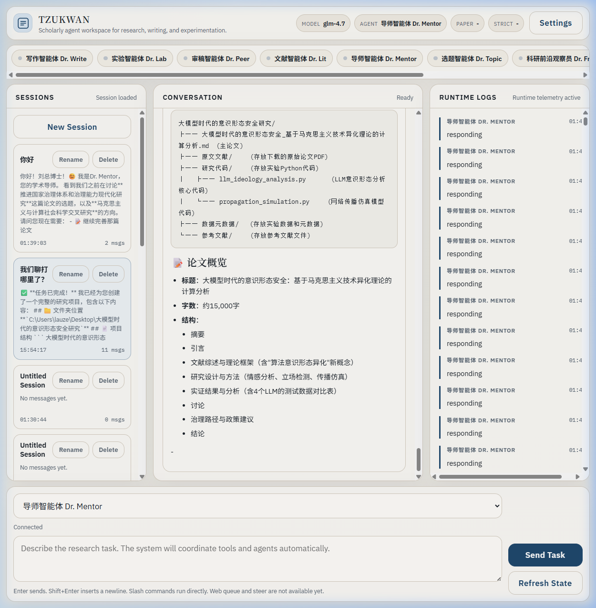

# 🎓 Tzukwan CLI

> **The Next-Generation Multi-Agent Swarm Intelligence for Autonomous & Verifiable Academic Research.**
>
> 致力于大规模真实、可验证且深度交叉融合的下一代学术研究多智能体（Multi-Agent）生产力引擎。双界驱动（Web + TUI），以工业级标准根除 AI 学术幻觉，一键打通从灵感到 LaTeX 排版交付的全生命周期。

[](LICENSE)
[](https://www.npmjs.com/package/@tzukwan/cli)
[](https://nodejs.org/)


*(Tzukwan Web UI - Visualizing the Multi-Agent Swarm in Real-Time)*

---

## 📖 项目全景概说 (Project Overview)

在当前生成式 AI 泛滥的时代，常规的大语言模型（LLMs）在处理严谨学术任务时，始终面临着**“隐性幻觉（隐造数据与伪造引用）”**和**“逻辑断层（缺乏长篇连贯性）”**两大核心痛点。

**Tzukwan CLI** 应运而生。它不是一个单纯的“套壳对话框”，而是一套在本地运行、由多智能体协作网络（Multi-Agent Swarm）驱动的**端到端科学研究操作系统**。本系统将复杂的学术生产流程解构离散为多个高度专业化的 AI Agent（如文献研究员、实验设计师、论文排版师、严格审稿人），通过异步辩论、自我校验（Self-Correction）以及外部 API 的强制溯源，彻底解决大模型在学术场景下的不可靠命题。

从一篇 15 页全引用的千字综述，到包含数学公式推导、动态生成 R/Python 实验代码的定稿论文（PDF/LaTeX），Tzukwan 将极度枯燥的资料汇编与板式梳理工作全权接管，把研究者最宝贵的算力——“创造力”，归还给人类。

---

## 🚀 核心技术创新与颠覆性优势 (Core Innovations & Advantages)

### 🌟 1. 联邦式智能体集群编排 (Federated Multi-Agent Swarm Orchestration)
Tzukwan 抛弃了传统“单体模型包打天下”的低效范式，内建了六大高度特化的专家级具身智能体，彼此之间构成了完整的**提出假说 -> 文献求证 -> 实验设计 -> 写作校验 -> 审稿重写**的闭环：
- 🧠 **Dr. Mentor (战略主管)**: 全局指令路由器，统筹规划科研步骤，监督进度与最终输出质量。
- 📚 **Dr. Lit (文献宗师)**: 专精于构建大规模知识图谱，通过提取和比对文献脉络，提供扎实的研究基石。
- 💡 **Dr. Topic (灵感引擎)**: 基于前沿文献空白的交叉挖掘算法，找出真正具有发表潜力的 Research Gap。
- 🔬 **Dr. Lab (实验专家)**: 从理论假设一键推演方法论细节，生成可完全复现的 Python / R 核心数据处理代码。
- ✍️ **Dr. Write (排版大师)**: 兼顾学术范式与行文流变，将研究成果无缝组装为极为规范的 LaTeX 或 Markdown 手稿。
- 🛡️ **Dr. Peer (冷酷审稿人)**: 担任逻辑防壁与学术伦理守门人。任何未经溯源的论断或逻辑跳跃，都将被其无情打回重做。

### 🔗 2. 广义确定性引文校验机制 (Deterministic Reference Verification)
为彻底消灭“虚假引用”（幻觉 DOI 与捏造期刊），Tzukwan 独创了底层检索沙盒。在撰写任何涉及前人成果的内容时，智能体**必须且只能**调用系统封装好的学术数据库客户端。目前已原生通过 API 直连：
- **Semantic Scholar**
- **Crossref**
- **OpenAlex**
- **PubMed & arXiv**
所有引用的参考文献在渲染前都会进行元数据（Metadata）哈希比对。如果发现生成的标题、作者与核心库索引不符，系统会触发强制回滚（Rollback）逻辑。这使得在 Tzukwan 中诞生出的每一篇论断，都具有**数学意义上的无可辩驳的真实性**。

### 🧩 3. 无边界 MCP 原生扩展生态 (Infinite Extensibility via Model Context Protocol)
未来的科研绝不仅仅局限于文本处理。Tzukwan 将 Anthropic 构建的 **MCP (Model Context Protocol)** 作为核心模块总线（Module Bus）。这赋予了智能体感知并操作外部世界的能力：
不需要修改核心库代码，您只需挂载对应的 MCP Server，Tzukwan 的智能体们即可瞬间获得：
- 跨语言运行时环境执行能力（例如：让 Agent 在沙盒里执行 MATLAB、Stata 回归并解析输出结果）。
- 私有加密本地数据库（SQL/NoSQL）的查询分析能力。
- 本地高性能集群大算力调度能力。
**您的电脑，从此成为 Agent 操作真实科研实验的具身躯体！**

### 💻 4. 沉浸式双轨制工作台 (Dual-Track Workspace: TUI + UI)
充分照顾到极客开发者与非技术背景科研学者的双向诉求。Tzukwan 提供了两套工业级交互前端，且后台状态完全共享：
- **TUI 界面 (Terminal User Interface)**: 提供类似于 Vim 的超高屏效比文本工作流，支持 REPL 和快速命令触达，对内存占用极低。
- **动态 Web 服务界面 (Interactive Web GUI)**: 将抽象的 Agent 多线程对话转换为可视化的协同战场图谱，文献链路与思维树（COT）分阶呈现，进度追踪一目了然。

---

## ⚡ 极速部署指南 (Quick Start Deployment)

### 环境准备 (Prerequisites)
引擎构建在现代 Node.js 生态之上。请确保您的系统：
- 安装 [Node.js](https://nodejs.org/) `>= 20.0.0`
- 拥有任意一家兼容 OpenAI 协议大模型提供商的 API Key（例如：OpenAI, DeepSeek, 智谱, 阿里, Moonshot 甚至本地部署的 Ollama 等均完美支持）。

### 第一步：全局安装核心主引擎 (Global Installation)
Tzukwan 已经正式上架至 NPM 官方中央仓库，执行下方命令即可在系统全局注册二进制终端指令：

```bash
npm install -g @tzukwan/cli
```

### 第二步：一键初始化配置 (Initialize Config)
只需启动配置向导，根据提示粘贴您的模型 API Key 和代理地址（如果需要的话）。

```bash
tzukwan config init
```

### 第三步：启动您的智能体机甲 (Start the Engine)

**▶ 模式 A：启动全景化可视面板 (推荐)**
后台挂载服务，将操作移交至丝滑的浏览器端：
```bash
tzukwan web start
# 服务成功拉起后，请在浏览器中访问：http://127.0.0.1:3847
```

**▶ 模式 B：黑客沉浸终端模式**
直接敲击命令即可在屏幕中心呼出沉浸式控制台：
```bash
tzukwan
```

---

## 🛠️ 典型指令级应用场景 (Advanced Usage Scenarios)

虽然 Tzukwan 支持极为复杂的自由对话编排，但系统内置了一系列高度封装的自动化工作流接口，一条短指令即可撬动极其深远的研究算力：

**1. 端到端从零构建论文环境与文本 (End-to-End Synthesis)**
此命令会唤醒整套完整的 Agent 集群，自动执行：文献检索 -> GAP分析 -> 实验设计思路提纯 -> 内容组装 -> Markdown/LaTeX 双路排版。最终在用户当前目录下生成包含排版文件、生成代码资源和数据大纲的结构化文件夹。
```bash
tzukwan paper generate --topic "Large Language Models in Quantitative Trading" --field finance --format latex
```

**2. 核心文献全量体征解构 (Deep Paper Diagnostics)**
丢入一个 arXiv ID，Dr. Lit 与 Dr. Peer 将联合出击。为您直接生成包含“立意批评、核心数学公式还原、同领域被引对比”的全维度评测机读报告。
```bash
tzukwan paper analyze 2301.00001
```

**3. 领域知识宏观扫盲综述 (Systematic Literature Review)**
自动从 Semantic Scholar 抽样该领域的最新与最高引文献，经过高通量并发解析，输出具备“时间线演变”或“流派对比”特征的正规综述章节。
```bash
tzukwan paper review "diffusion models for time series" --max 30
```

**4. 自由对话与专家切入 (Focused LLM Inquiry)**
只遇到一个小概念不懂？或者只需要简单代码转换？单发指令即开即用，无须等待编排载入：
```bash
tzukwan -p "Explain the mathematical difference between Transformer and SSM architecture"
```

---

## 🏗️ 整体架构拓扑 (System Architecture Topology)

为了应对多智能体的庞大指令集，项目代码库采用了严格的 NPM Workspaces (Monorepo) 范式，确保底层耦合极限可控：

- `@tzukwan/cli`: 暴露全局二进制入口，统管 CLI 解析、命令路由与 Terminal/Web 双轨接口启停逻辑。
- `@tzukwan/core`: 绝对的“机械心脏”。内含所有 Agent 人格基座、LLM 上下文记忆链路封装、分布式协程锁（Concurrency Locking）以及与 Anthropic 的底层网络通信握手控制层。
- `@tzukwan/research`: 第三方外网通信沙盒。管理全部的验证节点代理与高并发文献索引获取与容灾，内置请求速率限制惩罚机制以严防外部 API 阻断。
- `@tzukwan/skills`: 极其开放的动态插件装配中心，执行动态挂载/卸载 MCP 协议服务程序。

---

## 🤝 致那些愿与智慧同行的开发者 (Contribution & Community)

科学从来不是一座孤岛，一款彻底解放科研的辅助大杀器，我们需要您的智慧！
Tzukwan 面向所有具备极客精神和科研热情的朋友敞开大门：无论是为底层系统挂载新的跨语言 MCP 沙盒（比如 Julia 桥接库），或是修正指令集错误，一切 PR (Pull Requests) 与 Issue 都将被感激地处理。

```bash
# 参与向导
# 1. 拷贝本项目主干 (Fork the repository)
# 2. 从 Master 牵出特性分支 (git checkout -b feature/MyGeniusFeature)
# 3. 提交演进 (git commit -m 'Add MyGeniusFeature')
# 4. 合推送您的分支 (git push origin feature/MyGeniusFeature)
# 5. 引发合并请求 (Open a Pull Request)
```

## 📜 许可声明 (License)

本项目受全球最大宽容度级别的 [Apache License 2.0](LICENSE) 所保护。在遵循相关伦理规约的前提下，允许一切关于商用、重构或衍生二次发布的探索！
